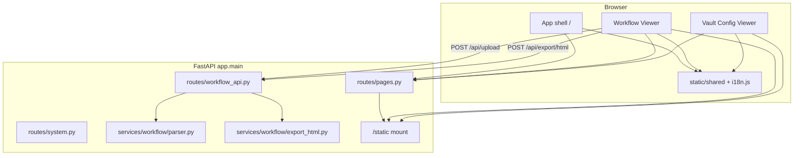

# NTI Workflow — arkitektur

Samlet beskrivelse af den aktuelle applikationsarkitektur efter fase 1–6 (modulopdeling, i18n, shared frontend, backend-split og oprydning).

## Overblik

NTI Workflow er en FastAPI-webservice med statisk frontend. Ingen database, ingen login. Tre brugerflader:

| Modul | Route | Data |
|-------|-------|------|
| App shell (forside) | `/` | Statisk HTML + navigation |
| Workflow Viewer | `/workflow/` | Excel-upload via API |
| Vault Config Viewer | `/vault-config/` | JSON lokalt i browseren |



## App shell

- **HTML:** `static/index.html`
- **JS:** `static/app-shell.js`
- **CSS:** `static/app-shell.css` + shared UI
- **i18n:** `static/i18n.js` + `static/i18n/*.json`
- Viser modulkort, sprogvalg og version (`/api/version`)

## Workflow Viewer

- **HTML:** `static/workflow/index.html`
- **Controller:** `static/workflow/workflow-controller.js` (upload, API-kald)
- **Diagram:** `static/viewer.js`, `static/viewer.css`
- **Shared:** `static/shared/utils/*`, `static/shared/ui/*`

### API-flow (upload)

1. Bruger vælger `.xlsx`/`.xlsm`
2. `workflow-controller.js` → `POST /api/upload` (multipart `file`)
3. `upload.py` validerer → `parser.py` parser Excel
4. JSON-payload returneres til `viewer.js`

### API-flow (HTML-eksport)

1. `viewer.js` sender payload + viewer context → `POST /api/export/html`
2. `export_service.py` + `export_html.py` bygger standalone HTML
3. Browser downloader fil med `Content-Disposition`

## Vault Config Viewer

- **HTML:** `static/vault-config/index.html` (inline script)
- **CSS:** `static/vault-config/vault-config.css`
- JSON læses med `FileReader` — **ingen backend-kald**
- Shared file/escape helpers fra `static/shared/`

## Shared frontend

Se [shared-frontend.md](shared-frontend.md).

- CSS tokens, knapper, formularer, feedback
- JS: `html.escape`, filvalidering, drag-drop, DOM-hjælpere
- Ingen domænelogik (ingen Vault/Workflow-specifik parsing)

## i18n

Se [i18n.md](i18n.md).

- Én autoritativ locale-fil per sprog (`static/i18n/<locale>.json`)
- `nti.locale` i `localStorage`, event `nti:locale-changed`
- Delt på tværs af alle tre moduler

## Backend

Se [backend-architecture.md](backend-architecture.md).

```
app/
  main.py                 # FastAPI app + routers + static mount
  core/version.py         # APP_VERSION
  core/settings.py        # STATIC_DIR, MAX_UPLOAD_BYTES, ...
  routes/pages.py         # HTML-sider
  routes/system.py        # /health, /api/version
  routes/workflow_api.py  # /api/upload, /api/export/html
  models/workflow.py      # Pydantic request-modeller
  services/workflow/      # parser, export, upload
```

**Entry point:** `uvicorn app.main:app`

**API-kontrakt:** `docs/openapi-contract.json`

## Statiske filer

- Mount: `/static` → `static/`
- Locale-filer, workflow, vault-config og shared assets serveres direkte
- Routere registreres før static mount

## Modulgrænser

| Grænse | Regel |
|--------|-------|
| Workflow ↔ Backend | Kun `/api/upload` og `/api/export/html` |
| Vault ↔ Backend | Ingen API — kun statiske filer |
| Shared ↔ Moduler | Utilities uden domæneviden |
| Route ↔ Service | HTTP i routes; parsing/eksport i services |

## Tests

```powershell
pytest -q
```

- API, parser, export, routes, i18n, shared frontend, vault config, backend-struktur, cleanup (fase 6)

## Deployment

- `Dockerfile` kopierer `app/` og `static/`
- `uvicorn app.main:app --host 0.0.0.0 --port 8000`
- Se [DEPLOY.md](../DEPLOY.md) og [PUBLISH.md](../PUBLISH.md)

## Historiske fase-rapporter

- `docs/refactor-phase-*-report.md` — dokumentation fra refaktoreringen
- `docs/refactor-history/phase-5/` — OpenAPI før/efter backend-split
